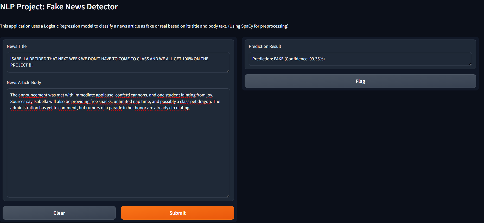

# **NLP Project: A Modular Approach to Fake News Detection**

This README provides a comprehensive overview of the "NLP Project" focused on fake news detection. The project was developed using a modular approach, leveraging both **VS Code** for local development and **Google Colab** for resource-intensive tasks such as model training.

## **1\. Project Structure**

The project was structured to separate different approaches and models into distinct files, allowing for a clean and organized workflow.

* **g1\_nlp\_project\_VSCode.ipynb**: This Jupyter notebook served as the primary environment for data exploration, cleaning, and feature engineering. It handled tasks that were not computationally expensive and could be efficiently run locally.  
* **g1\_nlp\_project\_RF\_BERT.py**: This Python script was designed for execution in a **Google Colab** environment. It was used to train and evaluate more complex models, including those based on **BERT** embeddings and **Random Forest classifiers**, which require significant computational resources (GPU/TPU).

## **2\. Data Loading and Initial Exploration**

The first step was to load the datasets and understand their characteristics.

* **Source Files**: train\_data.csv and test\_data\_no\_labels.csv were loaded using pandas.  
* **Data Shape and Distribution**: Initial analysis included checking the number of rows and columns, the distribution of labels (fake vs. real news), and the breakdown of news subjects.  
* **Date Processing**: The date column was converted to a proper datetime format, and the dataset was sorted chronologically. This step was crucial for preparing the data for time-series-related analysis.

## **3\. Feature Engineering**

To enhance the models' ability to detect fake news, several features were engineered from the raw data.

* **Text and Title Features**:  
  * **Character Count**: The number of capital letters and punctuation marks in both the text and title columns were calculated.  
  * **Combined Text**: The title and text were combined into a single column to provide a richer source of information for the models.

* **Time-based Features**:  
  * **Date Components**: The year, month, and day\_of\_week were extracted.  
  * **Weekend Flag**: A binary feature (is\_weekend) was created to indicate if the article was published on a Saturday or Sunday.  
  * **Holiday and Election Season Flags**: A USFederalHolidayCalendar was used to identify if an article was published on a federal holiday. A custom feature was also created to mark articles published during an election season.

## **4\. Modeling Approaches**

The project explored two distinct and powerful modeling approaches: a deep learning approach and a traditional machine learning pipeline.

### **Deep Learning with LSTM**

This approach, handled in the g1\_nlp\_project\_VSCode.ipynb notebook, utilized a recurrent neural network to process the text sequences.

1. **Text Tokenization**: The Tokenizer from tensorflow.keras.preprocessing.text was used to convert the raw text into integer sequences.  
2. **Padding**: pad\_sequences was applied to ensure all sequences had the same length for input into the neural network.  
3. **Model Architecture**: A **Sequential** model was built with the following layers:  
   * **Embedding Layer**: To convert integer-encoded text into dense vectors.  
   * **LSTM Layer**: A Long Short-Term Memory layer to capture dependencies in the text sequence.  
   * **Dense Layers**: Standard neural network layers for final classification.  
4. **Prediction**: The trained LSTM model was used to make final predictions on the validation set, which were then saved to a CSV file.

### **Traditional ML with TF-IDF and BERT Embeddings**

This approach, primarily handled in the g1\_nlp\_project\_RF\_BERT.py script, used classic NLP techniques and transformer models.

1. **Text Representation**:  
   * **TF-IDF (Term Frequency-Inverse Document Frequency)**: Articles were converted into numerical vectors based on the importance of words.  
   * **BERT Embeddings**: A pre-trained SentenceTransformer model was used to generate sophisticated sentence embeddings, capturing the semantic meaning of the text.

   

2. **Model Training**:  
   * **Random Forest Classifier**: A powerful ensemble model was trained on the engineered features and the TF-IDF and BERT embeddings.  
   * **XGBoost and Naive Bayes**: Other models were explored to compare performance.  
   * **Time Series Split**: TimeSeriesSplit was used for cross-validation to ensure the models were robust and could handle the chronological nature of the data.

## **5\. Visualization and Evaluation**

Throughout the project, visualizations were used to understand the data and evaluate model performance.

* **Histograms and Bar Plots**: Visualizations were created to show the distribution of labels, subjects, and other features.  
* **ROC Curve**: For binary classification models, the Receiver Operating Characteristic (ROC) curve was plotted to evaluate the trade-off between the true positive rate and the false positive rate.  
* **Confusion Matrix**: A confusion matrix was generated to visualize the model's performance on the validation set, showing the number of correct and incorrect predictions for each class.

**DEPLOYMENT USING GRADIO**

